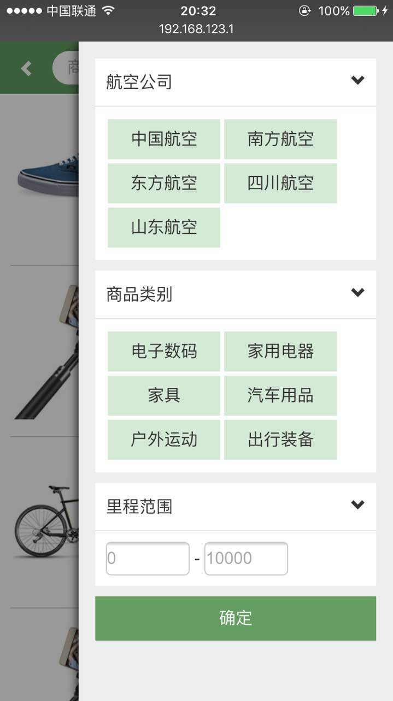

# 里程管家 - Mileager
app：里程管家 的mob纯前端项目

------

## 关于里程管家

里程管家是我的小伙伴的创新项目，它为用户提供里程查询和里程兑换的解决方案。

项目的[mockup粗原型](https://www.mockplus.cn/project/run/kpkNcqz2b1D07NgM?from=singlemessage&isappinstalled=0)

## 团队成员

* [刘柳](http://weibo.com/66cnu?is_all=1)
* [魏亮]()
* [陈鹏]()
* [马驰](http://www.himachi.cn)

## license

[MIT](LICENSE)

